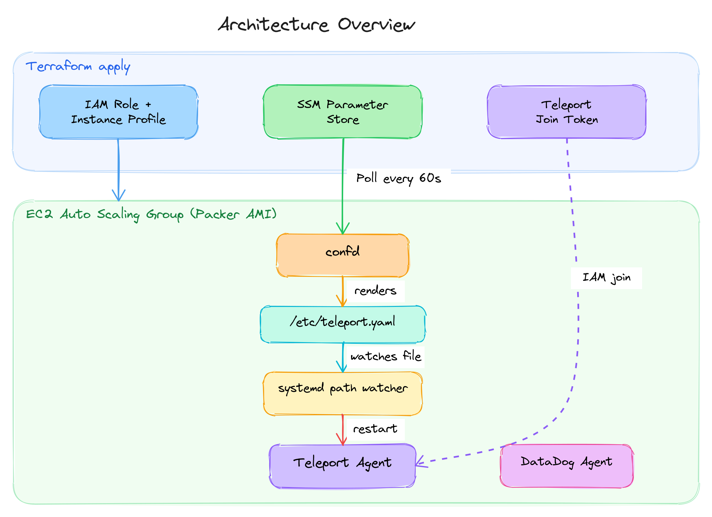

# Teleport Bootstrap

Production-ready [Teleport](https://goteleport.com/) agent infrastructure on AWS, built with Packer and Terraform.

This repository provides a complete toolkit for deploying Teleport agents outside of Kubernetes, using purpose-built EC2 instances with dynamic configuration management. It also includes an IRSA module for deploying Teleport kube agents on EKS.

## Architecture Overview



**Key design decisions:**

- **confd + SSM Parameter Store** for dynamic config: Terraform writes the full Teleport YAML to Parameter Store; confd polls it every 60 seconds and renders to `/etc/teleport.yaml`.
- **systemd path watcher** for reload: A systemd `.path` unit detects config file changes and triggers a Teleport restart — no polling, no `reload_cmd` race conditions.
- **IAM join method** for zero-secret bootstrapping: Agents authenticate to Teleport using their EC2 instance role, eliminating static tokens.
- **DataDog built-in**: Agent monitoring (journald logs + OpenMetrics scraping) is pre-configured in the AMI.

## Repository Structure

```
teleport-bootstrap/
├── packer/                          # AMI build definition
│   ├── build.pkr.hcl               # Packer template (Amazon Linux 2, ARM)
│   ├── variables.pkr.hcl           # Packer variables
│   ├── scripts/                    # Install scripts (Teleport, confd, DataDog)
│   └── assets/                     # Config files baked into AMI
│       ├── confd/                   # confd daemon config + systemd unit
│       ├── teleport-agent/          # Teleport init, systemd watcher, confd templates
│       └── datadog-agent/           # DataDog checks (journald, OpenMetrics)
├── modules/
│   ├── ec2-teleport-agent-pool/     # Terraform: ASG + IAM + SSM config + join token
│   └── teleport-kube-agent/         # Terraform: IRSA + join token for EKS agents
├── examples/
│   ├── rds-discovery/               # RDS auto-discovery with IAM auth
│   ├── elasticache-discovery/       # ElastiCache discovery + managed IAM identities
│   ├── mongodb-atlas/               # Static MongoDB Atlas with setproduct pattern
│   ├── eks-kube-agent/              # EKS kube agent with IRSA
│   └── complete/                    # All services combined
├── test/                            # Terratest E2E tests
├── .github/workflows/               # CI/CD (lint, test, build & publish)
└── docs/                            # Additional documentation
```

## Prerequisites

- **Teleport cluster** (v18.x) — self-hosted or Teleport Cloud
- **AWS account** with permissions for EC2, IAM, SSM, Secrets Manager, and ASG
- **Packer** >= 1.9 for AMI builds
- **Terraform** >= 1.3 for infrastructure deployment
- **DataDog account** with an API key stored in AWS Secrets Manager

## Quickstart

### 1. Build the AMI

```bash
cd packer/
cp .auto.pkrvars.hcl.example .auto.pkrvars.hcl
# Edit .auto.pkrvars.hcl with your VPC, subnet, and account details

packer init .
packer build .
```

This produces an Amazon Linux 2 ARM AMI with Teleport v18.6.8, confd, and DataDog Agent pre-installed. See [packer/README.md](packer/README.md) for details.

### 2. Deploy agents with Terraform

Pick an example that matches your use case:

```bash
cd examples/rds-discovery/
cp terraform.tfvars.example terraform.tfvars
# Edit terraform.tfvars with your values

terraform init
terraform apply
```

The module creates:
- An **Auto Scaling Group** running your custom AMI
- An **IAM role** with least-privilege policies for the enabled services
- An **SSM Parameter** containing the full Teleport agent configuration
- A **Teleport provision token** authorizing the IAM role to join your cluster

### 3. Verify the agent joined

```bash
tsh ls                    # SSH nodes
tctl db ls                # Discovered databases
tctl tokens ls            # Active join tokens
```

## Modules

### ec2-teleport-agent-pool

Deploys an ASG-based pool of EC2 Teleport agents. Supports SSH, Database, App, and Discovery services via configuration toggles.

| Feature | Description |
|---------|-------------|
| Auto Scaling Group | Mixed instances (on-demand + spot), rolling refresh |
| IAM join method | Zero-secret agent authentication |
| SSM + confd | Dynamic config without instance replacement |
| DataDog integration | Journald logs + Teleport metrics out of the box |
| Scheduled scaling | Scale up/down on a cron schedule |
| Custom IAM policies | Add per-deployment policies via `additional_inline_policies` |

See [modules/ec2-teleport-agent-pool/README.md](modules/ec2-teleport-agent-pool/README.md).

### teleport-kube-agent

Creates IAM roles (IRSA) and Teleport join tokens for deploying kube agents on EKS via Helm. Use `for_each` to bootstrap multiple clusters.

See [modules/teleport-kube-agent/README.md](modules/teleport-kube-agent/README.md).

## Examples

| Example | Services | Description |
|---------|----------|-------------|
| [rds-discovery](examples/rds-discovery/) | SSH, Discovery, DB | RDS auto-discovery with IAM authentication |
| [elasticache-discovery](examples/elasticache-discovery/) | SSH, Discovery, DB | ElastiCache discovery with managed IAM identities |
| [mongodb-atlas](examples/mongodb-atlas/) | SSH, DB | Static MongoDB Atlas with `setproduct` pattern |
| [eks-kube-agent](examples/eks-kube-agent/) | Kube, App, DB, Discovery | EKS kube agent bootstrap with IRSA |
| [complete](examples/complete/) | SSH, App, DB, Discovery | All services combined in one deployment |

## Documentation

- [Architecture](docs/architecture.md) — confd + SSM + systemd watcher pattern
- [DataDog Integration](docs/datadog-integration.md) — Monitoring setup and configuration
- [Terraform Cloud](docs/terraform-cloud.md) — Workspace setup and Teleport Machine ID
- [Upgrading Teleport](docs/upgrading-teleport.md) — Version upgrade path and breaking changes

## Teleport Version

This repository targets **Teleport v18.6.8**. Key v18 features leveraged:

- **ElastiCache Serverless** discovery support
- **Scoped join tokens** (roles restricted to enabled services)
- **DiscoveryConfig** as a Terraform resource
- **Managed IAM identities** for ElastiCache/MemoryDB access

## Testing

End-to-end tests use [Terratest](https://terratest.gruntwork.io/) to build an AMI, deploy it with the EC2 module, and validate the agent joins a local Teleport cluster.

```bash
cd test/
make setup        # Start local Teleport cluster
go test -v -timeout 30m
make teardown     # Stop local cluster
```

See [packer/README.md](packer/README.md) for test setup details.

## License

This bootstrap code is licensed under the [MIT License](LICENSE).

Teleport itself is licensed under the Apache License 2.0 (Community Edition) or a commercial license (Enterprise). Starting with Teleport v16, some features require a commercial license. See [LICENSE_NOTICE.md](LICENSE_NOTICE.md) for details.
