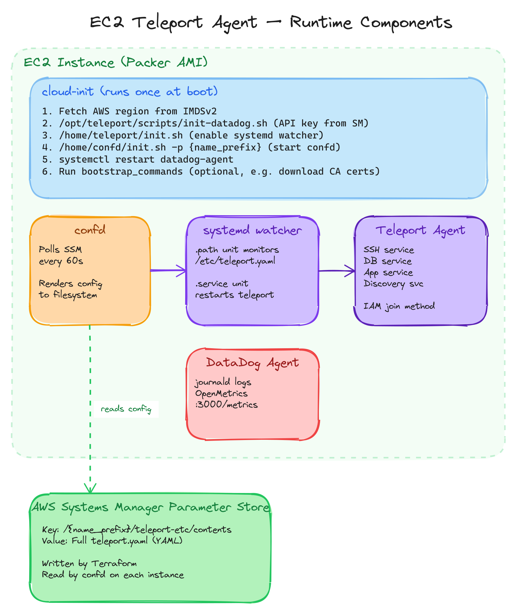

# Architecture

This document describes the runtime architecture of EC2-based Teleport agents deployed by the `ec2-teleport-agent-pool` module.

## Overview

The system has three layers:

1. **Build time** (Packer) — bakes an AMI with Teleport, confd, DataDog, and all config templates pre-installed.
2. **Deploy time** (Terraform) — creates the ASG, IAM roles, SSM parameters, and Teleport join tokens.
3. **Runtime** (EC2 instance) — cloud-init bootstraps the services; confd polls SSM for config changes.

## Component Diagram



## confd + SSM Parameter Store

[confd](https://github.com/abtreece/confd) is a lightweight daemon that watches a configuration backend and renders templates when values change.

### Why confd?

Teleport agent configuration can change frequently (new databases discovered, labels updated, service toggles). Without confd, updating config requires either:

- **Instance replacement** — slow, disruptive, wasteful for config-only changes
- **SSM Run Command** — requires additional orchestration and error handling
- **Custom scripts** — reinventing the wheel

confd provides a **pull-based, declarative** approach: Terraform writes the desired config to Parameter Store, and every agent converges within 60 seconds.

### How it works

1. **Terraform** writes the full `teleport.yaml` contents to SSM Parameter Store at `/{name_prefix}/teleport-etc/contents`.

2. **confd** runs as a systemd service, polling SSM every 60 seconds:
   ```toml
   # /etc/confd/confd.toml (rendered from confd.toml.tpl)
   backend = "ssm"
   interval = 60
   prefix = "/{name_prefix}"
   ```

3. A confd template resource maps the SSM key to a file:
   ```toml
   # /etc/confd/conf.d/teleport-yaml.toml
   [template]
   src = "teleport.yaml.tmpl"
   dest = "/etc/teleport.yaml"
   owner = "teleport"
   mode = "0644"
   keys = ["teleport-etc/contents"]
   ```

4. The template is a simple passthrough:
   ```
   {{ getv "/teleport-etc/contents"}}
   ```

### Config update flow

```
terraform apply
  → aws_ssm_parameter updated
    → confd detects change (within 60s)
      → /etc/teleport.yaml overwritten
        → systemd path unit triggers
          → teleport.service restarted
```

No SSH access, no Run Command, no instance replacement required.

## systemd File Watcher

confd intentionally does **not** use its built-in `reload_cmd` feature. During initial bootstrap, there's a race condition where confd might try to reload Teleport before it has started for the first time.

Instead, a **systemd path unit** decouples file rendering from service restart:

```ini
# teleport-watcher.path
[Path]
PathModified=/etc/teleport.yaml

[Install]
WantedBy=multi-user.target
```

```ini
# teleport-watcher.service
[Unit]
Description=Teleport Agent restarter
After=network.target

[Service]
Type=oneshot
ExecStart=/usr/bin/systemctl restart teleport.service
```

The `.path` unit watches for filesystem events (write, chmod, chown) on `/etc/teleport.yaml`. When triggered, it activates the corresponding `.service` unit, which performs a clean restart of Teleport.

**Advantages:**

- Eliminates race conditions during first boot
- Event-driven (not polling) — restart happens immediately after file write
- confd and Teleport are fully decoupled — either can restart independently
- Standard systemd patterns — debuggable with `systemctl status` and `journalctl`

## IAM Join Method

Agents authenticate to the Teleport cluster using the [IAM join method](https://goteleport.com/docs/agents/join-services-to-your-cluster/aws-iam/). No static tokens are distributed.

The Terraform module creates a `teleport_provision_token` with:

```hcl
spec = {
  roles       = ["Node", "Db", ...]   # Based on enabled services
  join_method = "iam"
  allow = [{
    aws_account = data.aws_caller_identity.current.account_id
    aws_arn     = "arn:aws:sts::${account_id}:assumed-role/${role_name}/i-*"
  }]
}
```

Only EC2 instances running with the specific IAM role created by the module can join. The `i-*` suffix ensures only EC2 instances (not developers assuming the role) can use the token.

## SSM Parameter Structure

The module writes a single SSM parameter per agent pool:

```
/{name_prefix}/teleport-etc/contents
```

The value is the complete `teleport.yaml` in YAML format, built dynamically in Terraform based on enabled services. The parameter tier defaults to `Standard` (4 KB limit) but can be set to `Intelligent-Tiering` for larger configs (e.g., ElastiCache discovery with many clusters).

## Teleport Configuration Building

The `teleport.tf` file in the EC2 module builds the agent config programmatically:

```hcl
locals {
  base_config = {
    version = "v3"
    teleport = {
      join_params  = { method = "iam", token_name = local.token_name }
      auth_server  = var.teleport_auth_server
      log          = { output = "stderr", severity = var.teleport_log_level, format = { output = "text" } }
      diag_addr    = "127.0.0.1:3000"
    }
    auth_service  = { enabled = false }
    proxy_service = { enabled = false }
  }

  # Conditionally merge service blocks
  ssh_config       = var.teleport_ssh_service.enabled ? { ssh_service = { ... } } : {}
  db_config        = var.teleport_db_service.enabled  ? { db_service  = { ... } } : {}
  app_config       = var.teleport_app_service.enabled  ? { app_service = { ... } } : {}
  discovery_config = var.teleport_discovery_service.enabled ? { discovery_service = { ... } } : {}

  teleport_config = yamlencode(merge(
    local.base_config, local.ssh_config, local.db_config,
    local.app_config, local.discovery_config
  ))
}
```

This ensures only the enabled services appear in the rendered config, keeping it minimal and auditable.

## Auto Scaling Group

The module creates a launch template + ASG with:

- **Mixed instances policy** — supports both on-demand and spot capacity
- **Rolling instance refresh** — new launch template versions trigger gradual replacement
- **IMDSv2 enforced** — instance metadata requires token-based access
- **Detailed CloudWatch monitoring** enabled by default
- **Optional scheduled scaling** — scale up during business hours, scale down at night

## Boot Sequence Timeline

```
t=0    EC2 instance launches
t=1s   cloud-init starts user-data script
t=2s   IMDSv2 token fetched, AWS_DEFAULT_REGION set
t=3s   init-datadog.sh: fetch API key from Secrets Manager, configure DataDog
t=5s   init.sh (teleport): enable systemd watcher units
t=6s   init.sh (confd): render confd.toml, start confd service
t=7s   confd starts polling SSM Parameter Store
t=8s   confd fetches config, renders /etc/teleport.yaml
t=8s   systemd path unit detects file, triggers Teleport restart
t=10s  Teleport agent starts, authenticates via IAM join
t=11s  Agent appears in Teleport cluster
t=12s  DataDog agent restarted to pick up final config
t=12s  bootstrap_commands execute (CA certs, custom setup)
```

Approximate total boot time: **15-30 seconds** from instance launch to agent join (depends on instance type and network).
