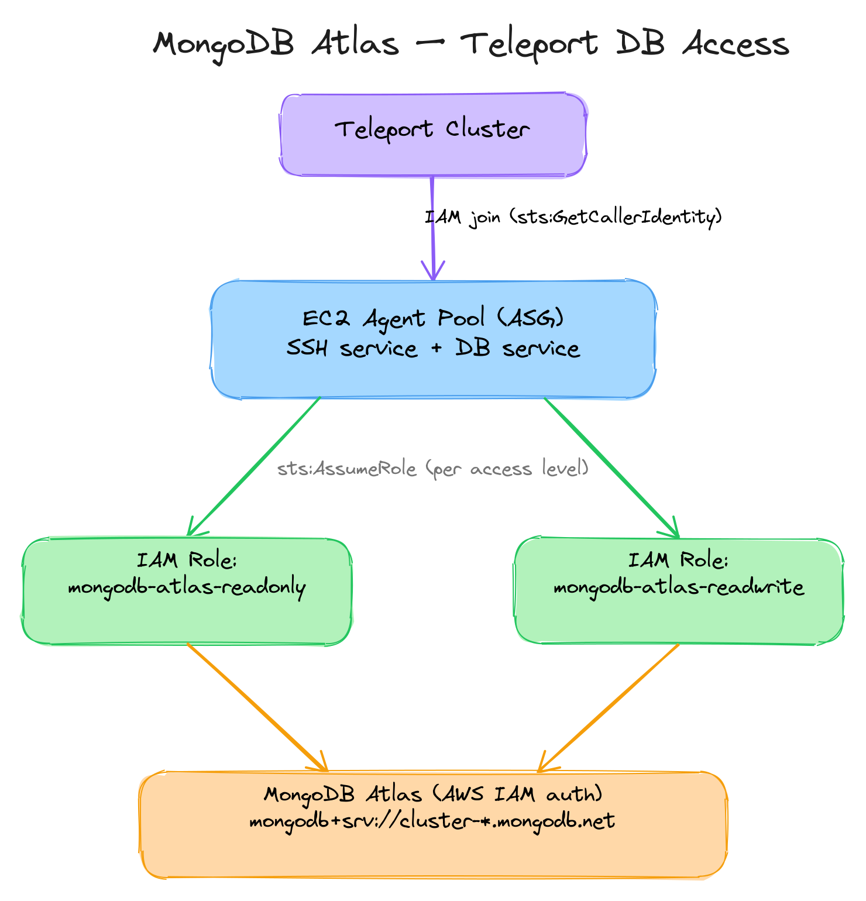

# MongoDB Atlas with Teleport Database Access

This example deploys a Teleport agent pool that proxies **static** MongoDB Atlas
databases using AWS IAM authentication. It demonstrates three key patterns:

1. **Static database registration** -- databases are declared directly in the
   Teleport config rather than being auto-discovered.
2. **TLS CA certificate bootstrap** -- the Let's Encrypt ISRG Root X1 CA
   certificate is downloaded at instance boot via `bootstrap_commands` so that
   Teleport can verify Atlas TLS connections (`verify-full`).
3. **`setproduct` pattern** -- a single locals block produces every combination
   of environment (staging, production) and access level (readonly, readwrite),
   eliminating repetitive database blocks.

## Architecture



## How the `setproduct` pattern works

The `locals` block defines two independent dimensions:

- **Environments** (`mongodb_clusters`): staging, production -- each with its
  own Atlas connection URI.
- **Access levels** (`mongodb_access_map`): readonly, readwrite -- each with a
  suffix, description, and IAM role ARN.

`setproduct(keys(local.mongodb_clusters), keys(local.mongodb_access_map))`
produces every pair:

| Environment | Access Level | Resulting Name         |
|-------------|-------------|------------------------|
| staging     | readonly    | myapp-staging-ro       |
| staging     | readwrite   | myapp-staging-rw       |
| production  | readonly    | myapp-production-ro    |
| production  | readwrite   | myapp-production-rw    |

Each combination is merged with the shared `mongodb_static_template` to produce
a complete database entry passed to the module's `teleport_db_service.databases`
list. Adding a new environment or access level requires only a single map entry.

## TLS CA certificate bootstrap

MongoDB Atlas uses certificates signed by Let's Encrypt. The Teleport database
service requires the root CA to verify connections when `tls.mode` is
`verify-full`. At instance boot, `bootstrap_commands` downloads the ISRG Root X1
certificate to `/home/teleport/atlasCA.pem` before the Teleport agent starts:

```hcl
bootstrap_commands = [
  "curl -fsSL -o /home/teleport/atlasCA.pem https://letsencrypt.org/certs/isrgrootx1.pem",
  "chown teleport:teleport /home/teleport/atlasCA.pem",
  "chmod 0644 /home/teleport/atlasCA.pem",
]
```

## IAM policy for MongoDB Atlas access

The agent instance profile includes an inline policy that allows
`sts:AssumeRole` on the MongoDB Atlas IAM roles. Each role is configured in
MongoDB Atlas to map to a specific database user with the appropriate privilege
level (read-only or read-write). The Teleport database service assumes the
correct role based on the `aws.assume_role_arn` field in each static database
entry.

## Usage

```bash
cp terraform.tfvars.example terraform.tfvars
# Edit terraform.tfvars with your actual values
terraform init
terraform plan
terraform apply
```

## Customisation

- **Add an environment**: add an entry to `mongodb_clusters` in `main.tf`.
- **Add an access level**: add an entry to `mongodb_access_map` in `main.tf`
  and create the corresponding IAM role in the Atlas-linked AWS account.
- **Change the naming scheme**: modify the key expression in `mongodb_configs`.

## Requirements

| Name      | Version  |
|-----------|----------|
| terraform | >= 1.3   |
| aws       | ~> 5.0   |
| cloudinit | ~> 2.2   |
| teleport  | ~> 18.0  |
