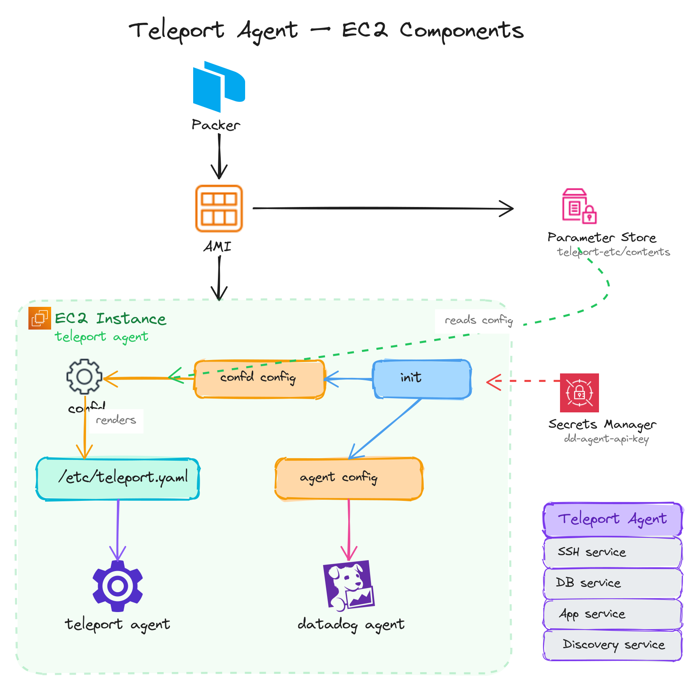

# Teleport Agent AMI

Base image for [Teleport Agent](https://goteleport.com/docs/agents/deploy-agents-terraform/)

- Amzn2
- ARM
- IMDSv2 is enforced

Run Teleport Agents outside of EKS for reliability. This AMI is purpose built for a Terraform module which forces defaults as expected by the components in the AMI.

## Install script

The install script is a copy of upstream:

```sh
curl -Lo scripts/install-teleport-upstream.sh https://goteleport.com/static/install.sh
```

## Highlights for Ops

### Component Diagram



### DataDog Agent

The DataDog Agent configuration is baked into the AMI and pre-configured to monitor Teleport Agent (metrics and logs). Only the API Key is fetched at runtime from AWS Secrets Manager (on cloud-init).

`init-datadog.sh` script is stored into the AMI for cloud-init to fetch the API key from Secrets Manager and write it to the config file:

```sh
/opt/teleport/scripts/init-datadog.sh \
  -k ${datadog_api_key_arn} \
  -t ${datadog_host_tags}
```

> NOTE: This script seems to fail on Amazon Linux 2 if `AWS_DEFAULT_REGION` is not set. Currently the Teleport Agent Pool TF Module sets this env var.

### Default Checks

Default DataDog Agent checks are burned into the AMI from [datadog-agent/conf.d](assets/datadog-agent/conf.d).

### Teleport Agent

The Teleport Agent configuration is fully managed by confd. Confd fetches the contents from AWS SSM Parameter Store (insecure value). The join method is expected to be IAM Role, which is managed by the Terraform module for this AMI.

Systemd File Watchers are used to reload Teleport Agent on config changes.

### Confd

[confd](https://github.com/abtreece/confd) is a Daemon used to dynamically manage configuration of all components from a Configuration Backend.

This AMI expects the Terraform configuration to provide all settings through AWS SSM Parameter Store. On init, Confd is configured to use AWS SSM ParameterStore as a config backend.

Components on the AMI provide confd manifests and templates as follows:

```sh
.
└── teleport-agent
    └── confd
        └── {conf.d, templates}
            └── teleport.yaml.tmpl               # teleport config (full contents pulled from ssm)
```

Hardcoded Non-Secret paths in AMI:

- [teleport-etc/contents](assets/teleport-agent/confd/templates/teleport.yaml.tmpl)

These paths are not configurable.

Due to race conditions on confd managed files during bootstrap, we avoid using the `reload_cmd` feature of confd.

Instead we use Systemd [watcher](https://superuser.com/a/1276457/345347) service triggered by a path (`/etc/teleport.yaml`) unit.

## Testing

The Teleport Agent AMI is tested using the Terraform module under `../modules/ec2-teleport-agent-pool`.

### Setup

To run tests, a local single instance teleport cluster is spun up as follows (windows not supported).

Teleport installation:

- for [darwin](https://goteleport.com/docs/installation/#macos)
  ```console
  curl -O https://cdn.teleport.dev/teleport-18.6.8.pkg
  sudo installer -pkg teleport-18.6.8.pkg -target /
  which teleport
  rm teleport-18.6.8.pkg
  ```
- for linux
  ```console
  curl https://goteleport.com/static/install.sh | bash -s 18.6.8
  ```
- for github actions
  ```yaml
  - name: Use Teleport 18.6.8
    uses: teleport-actions/setup@v1
    with:
      version: 18.6.8
  ```

Start local single instance teleport cluster:

```console
make setup
```

Stop local teleport cluster and clean up:

```console
make teardown
```

### Test

Run terratest:

```sh
export TF_TELEPORT_ADDR="0.0.0.0:3025"
export TF_TELEPORT_IDENTITY_FILE_PATH=./teleport-identity
go test -v -timeout 30m
```

Iterating tests, use the `SKIP_` variables together with the stages:

1. SKIP_build_ami=true to skip AMI build (requires `.test-data/Artifact.json` to exist for next stages)
1. SKIP_deploy_terraform=true to skip terraform init and apply
1. SKIP_validate=true to skip waiting for SSM Connection and running SSM documents
1. SKIP_cleanup_terraform=true to skip terraform destroy (targetted)
1. SKIP_cleanup_ami=true to skip AMI cleanup

For example, to build AMI and deploy it, but do manual validation:

```sh
SKIP_cleanup_ami=true SKIP_cleanup_terraform=true SKIP_validate=true go test -v -timeout 30m
```

### Teardown

```console
kill $(cat pid.txt) && rm pid.txt
```

## References

- https://github.com/gravitational/teleport/blob/v18.6.8/examples/agent-pool-terraform/aws/ec2-instance.tf
- https://github.com/gravitational/teleport-plugins/blob/v18.6.8/terraform/README.md#playing-with-examples-locally
- https://github.com/gruntwork-io/terratest/blob/v0.46.7/test/terraform_packer_example_test.go#L21
